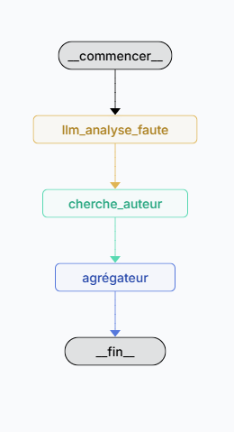

# 🧠 Citation Analyst — LangGraph.js + Groq + LLaMA 3.3

Un pipeline multi-agents en TypeScript qui **corrige**, **identifie l'auteur** et **raconte l'histoire** d'une citation, grâce à [LangGraph.js], [Groq](https://groq.com/) et **LLaMA 3.3 70B**.

<p align="center">
  
</p>

La logique principale, définie dans `src/graph.ts`, orchestre trois agents spécialisés qui se passent l'état de main en main pour produire une réponse enrichie à partir d'une simple citation.

---

## Ce que fait l'application

Le pipeline Citation Analyst :

1. Prend une **citation** en entrée (potentiellement mal orthographiée)
2. La **corrige** orthographiquement et grammaticalement
3. **Identifie l'auteur** de la citation corrigée
4. **Génère une histoire** contextuelle autour de la citation et de son auteur
5. Retourne l'ensemble des **étapes intermédiaires** pour traçabilité

---

## Démarrage rapide

### 1. Cloner le dépôt

```bash
git clone https://github.com/votre-username/citation-analyst.git
cd citation-analyst
```

### 2. Configurer les variables d'environnement

```bash
cp .env.example .env
```

Ajoutez ensuite votre clé API Groq dans le fichier `.env` :

```env
GROQ_API_KEY=votre_clé_api_groq
```

> Obtenez une clé gratuite sur [console.groq.com](https://console.groq.com/)

### 3. Installer les dépendances

```bash
npm install
```

### 4. Lancer l'application

```bash
npx @langchain/langgraph-cli dev
```

---

## Structure du projet

```
├── src/
│   ├── state.ts       # Schéma Zod + annotations LangGraph
│   ├── llm.ts         # Configuration Groq / LLaMA 3.3 70B
│   ├── noeuds.ts      # Les trois agents du pipeline
│   └── graph.ts       # Construction et exécution du graphe
├── .env.example
└── package.json
```

---

## Comment ça fonctionne

Le graphe enchaîne trois nœuds de manière séquentielle :

```
START → llm_analyse_faute → cherche_auteur → agregateur → END
```

### 🔵 Nœud 1 — `llm_analyse_faute`
Reçoit la citation brute et la corrige (orthographe, conjugaison, grammaire). La version corrigée est stockée dans l'état partagé et ajoutée au tableau `resultats`.

### 🟡 Nœud 2 — `cherche_auteur`
Prend la citation corrigée et interroge le LLM pour identifier son auteur. Le nom est ajouté à l'état et au tableau `resultats`.

### 🟢 Nœud 3 — `agregateur`
Combine la citation et l'auteur identifié pour générer une histoire contextuelle. Si la citation ou l'auteur est inconnu, il le signale simplement sans inventer.

---

## Comment personnaliser

1. **Changer la citation analysée** : modifiez le champ `citation` dans l'appel à `graph.invoke()` dans `graph.ts`.
2. **Modifier les prompts** : chaque nœud dans `noeuds.ts` contient un prompt système indépendant, modifiable librement.
3. **Étendre le graphe** : ajoutez de nouveaux nœuds dans `noeuds.ts`, puis reliez-les dans `graph.ts` avec `.addNode()` et `.addEdge()`.
4. **Changer de modèle** : remplacez `llama-3.3-70b-versatile` dans `llm.ts` par n'importe quel modèle compatible Groq ou LangChain.js.

Vous pouvez également enrichir ce projet en :
- Ajoutant une **interface web** pour soumettre des citations dynamiquement
- Intégrant une **base de données** de citations pour validation croisée
- Branchant [LangSmith](https://smith.langchain.com/) pour le traçage et le débogage avancé

---

## Développement

Pour itérer sur le graphe, vous pouvez modifier l'état entre deux exécutions afin de rejouer un nœud précis sans tout relancer. Idées d'expérimentations :

- Modifier le prompt du nœud `agregateur` pour changer le style de l'histoire (poétique, humoristique, académique…)
- Ajouter un nœud de **vérification** qui valide que l'auteur identifié est cohérent avec la citation
- Implémenter une **logique conditionnelle** : si l'auteur n'est pas trouvé, rediriger vers un nœud de recherche web

---

## Stack technique

| Technologie | Rôle |
|---|---|
| [LangGraph.js](https://github.com/langchain-ai/langgraphjs) | Orchestration du graphe d'agents |
| [LangChain Groq](https://js.langchain.com/docs/integrations/chat/groq) | Interface avec l'API Groq |
| [LLaMA 3.3 70B](https://groq.com/) | Modèle de langage (via Groq) |
| [Zod](https://zod.dev/) | Validation et typage des sorties structurées |
| TypeScript | Langage principal |

---

## Ressources

- [Documentation LangGraph.js](https://langchain-ai.github.io/langgraphjs/)
- [LangChain.js — Intégrations Chat](https://js.langchain.com/docs/integrations/chat/)
- [LangSmith — Tracing & Debugging](https://smith.langchain.com/)
- [Console Groq](https://console.groq.com/)

---

## Licence

MIT — libre d'utilisation, de modification et de distribution.
